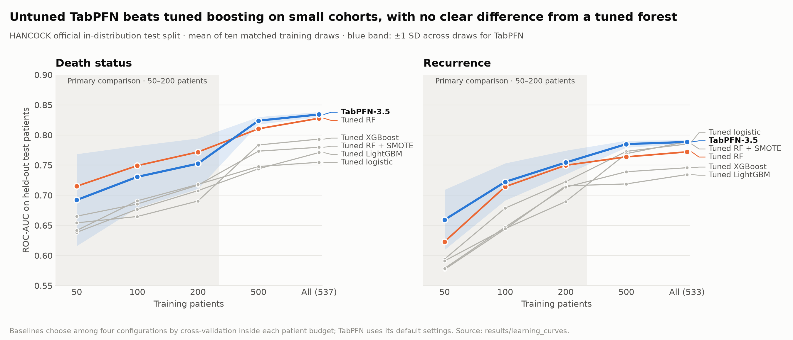
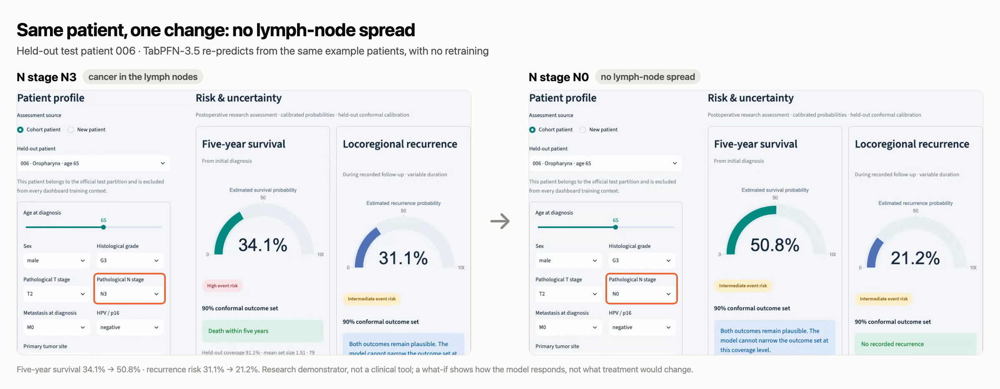

# OncoTabPFN

**Pretrained AI for the small patient cohorts hospitals actually have.**

We tested **TabPFN-3.5**, a pretrained model for tables, on **763 real head and neck cancer patients** from the HANCOCK cohort (FAU / University Hospital Erlangen). TabPFN learns from example patients in a single step, with no training loop, and we used its default settings throughout. Three tasks show where it helps.

[Task 1: small cohorts](#task-1-predict-outcomes-from-50200-patients) · [Task 2: published model](#task-2-improve-a-published-clinical-model-without-tuning) · [Task 3: patient what-if](#task-3-explore-a-single-patient) · [Run it](#run-it) · [Full methods](docs/METHODS.md)

## Task 1: Predict outcomes from 50–200 patients

**A hospital starting a new study often has only a few hundred labeled patients.** We gave six pipelines the same small patient sets and asked each to predict death and cancer recurrence for the official held-out test patients. The five baselines each chose the best of four settings by cross-validation. TabPFN used none.



| Mean AUC over 50, 100 and 200 patients | TabPFN (untuned) | Tuned Random Forest | Tuned LightGBM | Tuned XGBoost | Tuned logistic |
|---|---:|---:|---:|---:|---:|
| Death | 0.725 | **0.745** | 0.674 | 0.670 | 0.683 |
| Recurrence | **0.712** | 0.696 | 0.646 | 0.646 | 0.642 |

- **TabPFN beats tuned LightGBM and XGBoost on both outcomes**; all four paired 95% intervals exclude zero.
- **It is competitive with the tuned Random Forest, with no clear difference established**: −0.020 [−0.061, +0.019] for death, +0.016 [−0.018, +0.049] for recurrence.

The sixth pipeline, the forest with SMOTE, scored lower (0.689 / 0.665). AUC measures how well a model ranks patients who have the event above those who don't: 0.5 is chance, 1.0 is perfect. Each baseline searched four fixed settings, so this is evidence against those settings, not against every tuning strategy. [Report](results/learning_curves/REPORT.md)

## Task 2: Improve a published clinical model without tuning

**The HANCOCK authors published a Random Forest with synthetic oversampling (SMOTE)** in Nature Communications (2025). We reproduced it exactly: all six AUCs match the paper. Then we gave untuned TabPFN the same patients and features.

| Death prediction, AUC | Published model | Same forest without SMOTE (our control) | TabPFN |
|---|---:|---:|---:|
| Test patients similar to training | 0.79 | 0.825 | **0.836** |
| Test patients different from training | 0.78 | 0.774 | **0.790** |
| Oropharyngeal tumors held out | 0.71 | 0.709 | **0.768** |

- **TabPFN has the higher death AUC on all three official splits.**
- **The clearest gain is a higher death AUC on the held-out oropharynx cohort:** +0.059 [+0.011, +0.106] against the same forest on identical data. In distribution, most of the gain over the published model comes from removing SMOTE; out of distribution, the differences are small and inconclusive.
- **Recurrence does not improve:** all three intervals against the forest include zero.

The forest control was added after the main results were seen, and the intervals are not adjusted for multiple comparisons. [Report](results/paper/REPORT.md) · [Forest control](results/paper_rf_control/REPORT.md)

## Task 3: Explore a single patient

**The dashboard turns the model into something a clinician-researcher can question.** Pick a held-out patient and get a five-year survival and recurrence estimate, with a conformal outcome set showing what the model cannot rule out. Then change one detail and ask again. Here, the same patient without lymph-node spread:



TabPFN answers from the same example patients, with no retraining. A what-if shows how the model responds, not what a treatment would change. Other tabs show the saved experiments and SHAP explanations. The dashboard's five-year endpoints differ from the paper endpoints; see [methods](docs/METHODS.md#clinical-motivation-and-endpoints).

## Limits

- **Single center, exploratory.** All results come from one cohort and reuse the official test patients; independent validation is still needed.
- **Not a clinical tool.** No result here shows better patient outcomes.
- **Tuning and oversampling did not help TabPFN.** SMOTE made it worse, and a tuned configuration did not beat the default ([details](docs/METHODS.md#optimization-and-shap-explanations)).

## Run it

```bash
python3.12 -m venv .venv && source .venv/bin/activate
pip install -r requirements.txt
python data/download_hancock.py && python data/dataset_builder.py
streamlit run app/app.py
```

Browsing patients and saved results needs no token. For live predictions, put a [Prior Labs API key](https://platform.priorlabs.ai/account/api-keys) in `.env` as `TABPFN_TOKEN=...`. Predictions run through the Prior Labs API (`tabpfn-client`, TabPFN-3.5), which receives model features and training labels but no patient identifiers. The experiments use a separate pinned environment; see [setup details](docs/METHODS.md#local-setup-details).

## Evidence

Every experiment froze its protocol before evaluation and saved its predictions, and a verification script recomputes the reported numbers.

| Task | Experiment | Report |
|---|---|---|
| 1 | Learning curves: 600 evaluations, 6 models, 10 matched training draws | [Report](results/learning_curves/REPORT.md) |
| 2 | Published model vs TabPFN: 90 runs; no-SMOTE forest control: 30 runs | [Report](results/paper/REPORT.md) · [Control](results/paper_rf_control/REPORT.md) |
| 3 | Dashboard: held-out predictions with conformal outcome sets | [Methods](docs/METHODS.md#dashboard-uncertainty-and-interpretation) |

Further experiments (TabPFN tuning, SHAP explanations, calibration), endpoint definitions and every reproduction command are in [docs/METHODS.md](docs/METHODS.md).

## Data, citation and license

HANCOCK is a single-center, retrospective cohort of 763 patients. The data is not included in this repository; download it from the [official portal](https://www.hancock.research.uni-erlangen.org/download). Please cite:

> Dörrich et al. A multimodal dataset for precision oncology in head and neck cancer. *Nature Communications* **16**, 7163 (2025). https://doi.org/10.1038/s41467-025-62386-6

Code is licensed under [Apache 2.0](LICENSE). `src/paper_protocol.py` adapts the authors' [reference implementation](https://github.com/ankilab/HANCOCK_MultimodalDataset), also Apache 2.0 ([license](third_party/HANCOCK_MultimodalDataset-LICENSE)).
