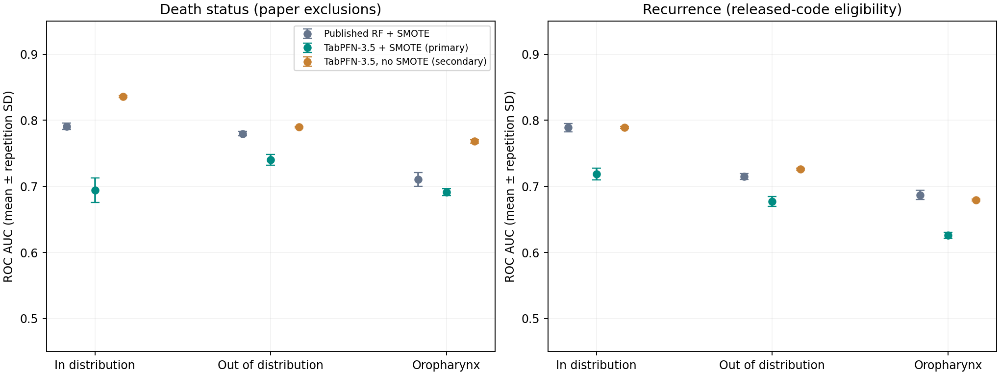

# OncoTabPFN: methods, complete results and reproduction

Detailed companion to the [README](../README.md). Every number here comes from the reports and tables in `results/`.

## Local setup details

Python 3.12 is recommended. From the project root:

```bash
python3.12 -m venv .venv
source .venv/bin/activate
pip install -r requirements.txt

python data/download_hancock.py
python data/dataset_builder.py
streamlit run app/app.py
```

Alternatively, use `uv venv --python 3.12` and `uv pip install -r requirements.txt`. On macOS, LightGBM may require `brew install libomp`; the verified machine already had OpenMP installed.

The app bootstraps missing data on first launch. No token is needed to inspect patients, missingness, or saved benchmark results. The verified local server uses **http://127.0.0.1:8517**:

```bash
streamlit run app/app.py --server.address 127.0.0.1 --server.port 8517
```

### TabPFN-3.5 access

Create a key at [Prior Labs](https://platform.priorlabs.ai/account/api-keys), then put it in the git-ignored `.env` file:

```dotenv
TABPFN_TOKEN=your_token_here
```

Alternatively, export `TABPFN_TOKEN` in your shell or configure `.streamlit/secrets.toml`. Do not commit credentials. Reload the app after configuring the token.

The selected backend is **`tabpfn-client>=0.6.0`**, explicitly instantiated with `create_default_for_version(ModelVersion.V3_5)`. Model execution uses the Prior Labs API. Model inputs and training labels are sent to Prior Labs; identifiers, event-time fields, and other excluded columns are not passed as model features. Use only data you are authorized to submit. See the [official SDK](https://github.com/PriorLabs/tabpfn-client).

Inference requires internet access, a valid token, model entitlement, and sufficient API quota. Initial dashboard inference also builds contexts and calibrators. The UI reports elapsed time and makes no instant or single-forward-pass guarantee; the SDK may ensemble multiple passes.

## Matched comparison with the HANCOCK paper

The separate **Paper replication** dashboard tab compares TabPFN-3.5 against the Random Forest experiment in Figure 2 of [Dörrich et al., Nature Communications (2025)](https://doi.org/10.1038/s41467-025-62386-6). Results and methodological qualifications are in [results/paper/REPORT.md](../results/paper/REPORT.md). This experiment does not reuse the dashboard's five-year labels or claim to reproduce the separate foundation-model/RFS experiments.

**Measured result: all 90 runs completed.** The strict model replacement retaining SMOTE underperformed RF in all six comparisons. The prespecified no-SMOTE TabPFN variant had higher death-status AUC on all three splits; the paired interval excludes zero in distribution and for Oropharynx, but not out of distribution. Recurrence AUC remained broadly comparable. All six reproduced RF scores match the paper at its two-decimal precision.

| Endpoint | Split | Reproduced RF + SMOTE | TabPFN + SMOTE, primary | TabPFN without SMOTE, secondary |
|---|---|---:|---:|---:|
| Death status | In distribution | 0.791 | 0.694 | 0.836 |
| Death status | Out of distribution | 0.780 | 0.740 | 0.790 |
| Death status | Oropharynx | 0.711 | 0.691 | 0.768 |
| Recurrence | In distribution | 0.789 | 0.719 | 0.789 |
| Recurrence | Out of distribution | 0.715 | 0.677 | 0.727 |
| Recurrence | Oropharynx | 0.687 | 0.626 | 0.680 |

Values are mean ROC AUC over five repetitions. For no-SMOTE TabPFN, the death-status AUC improvements have paired 95% bootstrap intervals of **+0.045 [0.002, 0.093]** in-distribution and **+0.058 [0.007, 0.107]** in Oropharynx. The other four intervals include zero. These are exploratory, unadjusted intervals, not confirmation of general superiority. Raw Brier score and ECE are lower for no-SMOTE TabPFN in all six comparisons; this does not establish clinical calibration. The existing five-year dashboard benchmark remains a separate experiment.



The protocol is saved **before evaluation**. It fixes all three official partitions, five repetitions, published RF hyperparameters, original core package versions, and two separate advancing `RandomState(42)` streams for RF and SMOTE. The primary TabPFN comparison uses exactly the same augmented training matrices and test matrices. The secondary, prespecified TabPFN variant removes SMOTE. Neither uses test-based tuning or model selection.

Frozen inputs include clinical, pathology, hematology, ICD-code and CD3/CD8 TMA cell-density tables from the authors' v1.0.0 release. Preprocessing matches their train-fitted imputation, one-hot encoding and standardization. UMAP is only a visualization in their script and is not a model input. Published tables inherit upstream cohort-wide encoding and blood imputation; this reproduces that pipeline rather than independently rebuilding it.

**Endpoint fidelity:** death status excludes known non-tumor-specific deaths but retains unknown causes and has no fixed horizon. Recurrence uses the released code's ≤1095-day positive criterion and its negative criterion of no recurrence plus either >1095-day follow-up **or living status**. The latter exception differs from the prose and includes 180 living nonrecurrent patients with ≤1095 days of follow-up. It is documented rather than silently changed.

| Endpoint | Eligible | In train/test | Out train/test | Oropharynx train/test |
|---|---:|---:|---:|---:|
| Paper death status | 674 | 537 / 137 | 535 / 139 | 376 / 298 |
| Paper recurrence | 667 | 533 / 134 | 534 / 133 | 380 / 287 |

Run from the project root, keeping the app environment separate:

```bash
# Skip cloning if this frozen checkout already exists.
git clone --depth 1 --branch v1.0.0 https://github.com/ankilab/HANCOCK_MultimodalDataset.git vendor/HANCOCK_MultimodalDataset
uv venv .venv-paper --python 3.12
uv pip install --python .venv-paper/bin/python -r requirements-paper.txt
.venv-paper/bin/python scripts/download_paper_splits.py
.venv-paper/bin/python src/paper_benchmark.py
.venv-paper/bin/python scripts/verify_paper_results.py
```

**Post-hoc no-SMOTE forest control.** `.venv-paper/bin/python src/paper_rf_control.py` refits the published per-split RF hyperparameters on the frozen original training matrices, with the same advancing `RandomState(42)` stream, and pairs them with the saved TabPFN predictions. It takes about 20 seconds, makes no API calls, and writes [results/paper_rf_control](../results/paper_rf_control/REPORT.md) without modifying `results/paper`. The hyperparameters were searched by the authors for the SMOTE pipeline and are not retuned.

The checked-out commit must be `521b99b03a94008b28df5c3df4aa5f82aa14b25a`. Source files, features, official splits and environment versions are checked and hashed. No synthetic fallback is permitted. The existing `.env` supplies `TABPFN_TOKEN`; the API receives matrices and training labels, without patient IDs. To resume API work, run `--phase tabpfn`; to regenerate the report without inference, use `--phase report`. `--phase rf` runs the 30 published RF evaluations alone. Protocol changes require explicitly archiving the previous `results/paper` directory; results from different protocols cannot be pooled.

Outputs include `protocol.json`, `cohort_audit.json`, `metrics.csv`, `summary.csv`, `predictions.csv`, `paired_comparisons.csv`, both comparison plots, and `REPORT.md`. Local `inputs/` stores exact matrices and `runs/` stores resumable predictions/configuration. Mean AUC and repetition SD follow the paper. Paired 95% AUC-difference intervals use 2,000 stratified patient bootstraps, retaining all five repetitions together; these are exploratory, conditional on fixed training cohorts and unadjusted for multiple comparisons. The test partitions overlap. Brier/ECE describe raw probabilities, not demonstrated clinical calibration.

Protocol adaptations in `src/paper_protocol.py` retain attribution to the authors' Apache-2.0 code; their license is included as [third_party/HANCOCK_MultimodalDataset-LICENSE](../third_party/HANCOCK_MultimodalDataset-LICENSE). Five protocol checks cover endpoint boundary rules, exact preprocessing and all six RF configuration matches to the frozen source, disjoint patients, and paired bootstrap behavior.

## Paper-matched learning curves and the SMOTE control

The follow-up study in [results/learning_curves](../results/learning_curves/) fixes the paper's endpoints, 79 original features and official **in-distribution** test partition. It uses ten nested stratified training draws (seeds 42–51), each at **50, 100, 200, 500 and Full** patients. Full means 537 training patients for death status and 533 for recurrence; the 137 / 134 test patients never enter training. The new results appear at the top of **Paper replication** in the dashboard.

Six pipelines receive the same original patients and preprocessing matrices: untuned TabPFN-3.5, tuned Random Forest without SMOTE, tuned Random Forest with SMOTE, tuned LightGBM, tuned XGBoost and L2 logistic regression. Each baseline selects among four fixed candidates by mean three-fold AUC **inside the N-patient subset**. Forests use 300 trees and boosting models 200. The two RF variants search the same grid independently, providing a pipeline-level oversampling control. This is a bounded search, not exhaustive tuning; the exact published forest reproduction remains the separate 90-run experiment above.

Preprocessing is refit within each subset and every inner training fold. SMOTE operates only on training folds, using an adaptive neighbor count at small N. A regularized sigmoid is fitted to the chosen candidate's out-of-fold probabilities and labels from the same N patients. The final estimator then uses all N patients. Both raw and recalibrated scores are retained; calibration receives no extra patients or test labels. Reusing selected-candidate OOF predictions is not an unbiased training-score estimate. The inherited cohort-wide processing in the published feature tables still applies.

The **primary comparison** is equally weighted mean **raw ROC-AUC over N=50,100,200**, then averaged over ten seeds. Every size is also reported separately. Average precision, Brier, ECE and log loss are secondary outcomes; Brier reflects overall probability accuracy, not calibration alone. Paired 95% intervals use 2,000 class-stratified held-out patient resamples with all sizes and repeats kept together. They are conditional on the selected training draws and unadjusted across comparisons. These test patients were examined in earlier experiments, so findings remain exploratory.

```bash
uv pip install --python .venv-paper/bin/python -r requirements-learning-curves.txt
.venv-paper/bin/python src/learning_curves.py --phase prepare
.venv-paper/bin/python src/learning_curves.py --phase baselines --workers 3
.venv-paper/bin/python src/learning_curves.py --phase tabpfn
.venv-paper/bin/python scripts/verify_learning_curves.py
# Regenerate charts and tables without API calls:
.venv-paper/bin/python src/learning_curves.py --phase report
# README figure, from the saved metrics:
.venv/bin/python scripts/plot_readme_figure.py
```

**Budget adjustment:** to fit the available API allowance, the calibration comparison was reduced to the first five fixed seeds (42–46) for **every** model and endpoint. All ten draws remain in the primary raw-AUC comparison. Both raw and recalibrated probability curves use those same five seeds; the matched figures are also in `calibration_summary.csv`. Surplus calibration predictions already computed are preserved locally but excluded from that comparison. No scores were used to choose which seeds to retain. The change, timing and 1.1-million additional-token cap are recorded in `quota_amendment.json`; the revised remaining estimate was 100 prediction calls / 1 million tokens. The runner checks actual account usage before each case and stops at the cap.

The default `--phase all` runs every phase and honors the saved amendment. The complete amended study has **600 final evaluations** and **900 metric rows**: 600 raw and 300 calibrated. All runs are resumable; changed protocol code, packages or frozen inputs require a separate `--output` directory. Failures stop execution rather than silently dropping a comparator. The generated [report](../results/learning_curves/REPORT.md), [paired intervals](../results/learning_curves/paired_comparisons.csv) and [verification](../results/learning_curves/verification.json) are authoritative for measured findings.

**Completed findings:** TabPFN leads the tested LightGBM and XGBoost configurations on the primary low-sample measure for both endpoints. The no-SMOTE Random Forest control substantially narrows the claim:

| Mean raw AUC across N=50,100,200 | TabPFN | RF without SMOTE | RF with SMOTE | LightGBM | XGBoost | Logistic |
|---|---:|---:|---:|---:|---:|---:|
| Death status | 0.725 | **0.745** | 0.689 | 0.674 | 0.670 | 0.683 |
| Recurrence | **0.712** | 0.696 | 0.665 | 0.646 | 0.646 | 0.642 |

Against no-SMOTE RF, TabPFN's paired AUC difference is **−0.020 [−0.061, +0.019]** for death status and **+0.016 [−0.018, +0.049]** for recurrence. Both intervals include zero. Against LightGBM and XGBoost, all four exploratory AUC-difference intervals exclude zero in TabPFN's favor. This supports an advantage over the tested boosting baselines, **not general superiority over a tuned forest**.

On the five matched calibration draws, raw mean Brier at N=50–200 is 0.1385 for TabPFN versus 0.1322 for RF on death status, and 0.1502 versus 0.1611 on recurrence. Lower is better. Sigmoid recalibration does not uniformly improve Brier or ECE; no universal calibration advantage is claimed. With Full training, raw death-status AUC is 0.834 for TabPFN versus 0.828 for RF; recurrence is 0.789 for both TabPFN and logistic regression (difference −0.0004).

The amended continuation consumed exactly **1,000,000 additional tokens**; this is the continuation's usage, not the cost of the entire study. Verification reconstructed all 800 preprocessing matrices, checked 300 disjoint inner folds, recomputed 6,225 candidate-fold scores and all 60 paired intervals, and verified the 900 exported metric rows. The completed dashboard view passed Streamlit AppTest without API calls.

An additional [numerical audit](../results/learning_curves/numerical_verification.json) checked matrix-product warnings in the frozen macOS environment: 1,300 logistic fits and 575 saved sigmoid calibrators reproduced their predictions, with independent probability calculations agreeing within 3×10⁻¹⁵ and objective-gradient checks passing. It did not alter model scores. Reproduce with `.venv-paper/bin/python scripts/verify_learning_numerics.py`; run `.venv/bin/python scripts/verify_learning_curve_ui.py` for the completed research view.

**Post-hoc calibration sensitivity.** The frozen sigmoid calibrator has an unconstrained slope, and in 11 of the 300 matched calibration runs (all at N = 50 or 100) it learned a slope ≤ 0, reversing the test ranking. `.venv-paper/bin/python src/learning_curve_recalibration.py` refits every calibrator with a nonnegative slope from the saved out-of-fold and test probabilities, without API calls, and writes [results/learning_curves/recalibration](../results/learning_curves/recalibration/REPORT.md). Mean calibrated Brier changes by less than 0.001 and ECE by at most 0.006, and no calibration conclusion changes. The frozen study and its raw-AUC primary outcome are unchanged.

## Optimization and SHAP explanations

The **Optimization & explanations** dashboard tab reads a separate experiment in `results/optimization/`. The original 90-run paper replication and clinical prediction models remain unchanged.

Six configurations were fixed before evaluation: paper preprocessing, native categorical handling, Thinking mode with each, native clinical/pathology only, and native clinical/pathology/blood. All omit SMOTE. Each endpoint uses the same three stratified folds within its official in-distribution training cohort. Thinking uses medium effort, a 60-second fit cap, and the ROC-AUC objective. Selection maximizes mean validation AUC, with exact ties resolved by Brier score then fixed configuration order. All 36 validation runs completed, and both choices were recorded before either final test was scored.

**This search did not establish an improvement on the reserved test set.** Both endpoints selected the 19-feature clinical/pathology model; its training CV AUC was 0.776 for death status and 0.752 for recurrence. The post-selection single-fit results are:

| Endpoint | Untuned no-SMOTE baseline AUC | Selected model AUC | ΔAUC, paired 95% interval |
|---|---:|---:|---:|
| Death status | 0.835 | 0.811 | −0.023 [−0.081, +0.036] |
| Recurrence | 0.790 | 0.785 | −0.005 [−0.044, +0.034] |

These are seed-42 comparisons against the earlier saved seed-42 baseline, not comparisons against its five-seed mean. Validation scores of the selected winner are optimistic and are not nested-CV performance estimates. The test cohort was already examined in the preceding experiment, so these follow-up results are exploratory. No extra configurations were added after seeing test scores. Thinking is not automatically better for this cohort.

**Naming:** the earlier paper benchmark's `tabpfn_native` means *no SMOTE with paper preprocessing*. In this new experiment, `native_default` means *native categorical handling*, preserving the published category codes and remaining missing values. The published tables still inherit the authors' upstream encoding and blood imputation; native handling does not recover raw, unimputed labs.

Explanations use the fixed selected model's actual event probabilities, not a surrogate:

- SHAP `PermutationExplainer` masks **original clinical columns before preprocessing**, keeping each categorical variable intact. The selected models use 19 original features.
- Twelve held-out patients per endpoint are sampled randomly without reference to their outcomes or risks. Eight random training patients supply the background. Two independently seeded runs, each with two forward/reverse permutation orderings, are averaged. This is an exploratory, approximate attribution analysis, not a whole-cohort feature-importance estimate.
- The baseline is the model's mean prediction on those eight background patients, not the observed event rate. Each waterfall is checked against the patient's actual predicted probability.
- A second measure jointly shuffles each included modality three times across **all** held-out test patients and records the AUC decrease and Brier increase. The selected model includes only clinical and pathology modalities; omitted modalities do not receive attribution scores.
- Beeswarm plots, per-patient waterfalls, raw attribution CSVs and ordering-sensitivity measures are saved. Category colors represent published feature codes, which are not necessarily clinically ordered. Background-sample sensitivity is not estimated; correlated features can share attribution, and masking can create unusual feature combinations. SHAP is not causal evidence.

Run from the project root after the paper replication:

```bash
uv pip install --python .venv-paper/bin/python -r requirements-explain.txt
.venv-paper/bin/python src/tune_tabpfn.py
.venv-paper/bin/python src/explain_tabpfn.py
.venv-paper/bin/python scripts/verify_optimization.py
```

The optimizer resumes completed folds; `--phase report` regenerates reports without inference. SHAP budgets can be set using `--patients`, `--background`, `--orderings`, and `--permutation-repeats`; changing them requires archiving the existing explanation artifacts. Predictions are cached to resume interruptions. Fitted server references and local preprocessing live in git-ignored `results/optimization/models/`; they require the same API account to reload. Opening the dashboard never launches tuning or SHAP API calls. The app environment does not need SHAP installed.

See [optimization report](../results/optimization/REPORT.md), [validation metrics](../results/optimization/cv_metrics.csv), and [post-selection comparisons](../results/optimization/test_summary.csv). The independent audit checks patient isolation, selection timestamps, all recorded metrics, model identity, background membership, and SHAP probability reconstruction.


## Clinical motivation and endpoints

Head and neck cancer cohorts contain heterogeneous tumors and incomplete modalities, while clinically useful labeled samples can be scarce. This project tests whether a pretrained tabular model transfers effectively to that setting. Its comparative advantage is a hypothesis to evaluate, not an assumed result.

The predictor is a **postoperative research assessment** because it uses pathological staging. Endpoints are timed from the original diagnosis; this is not a preoperative model or a causal treatment simulator.

| Endpoint | Positive label | Negative label | Exclusions / interpretation |
|---|---|---|---|
| `target_survival_5y` | Documented death within `5 × 365.25` days | Documented survival beyond that horizon | Early-censored, unknown-status, or invalid-follow-up records are unlabeled |
| `target_recurrence` | HANCOCK `recurrence=yes`, documented as locoregional recurrence | `recurrence=no` | Unknown status is unlabeled; follow-up duration varies |

The survival gauge displays **`1 − P(death within five years)`**. Early-censoring exclusions may introduce selection bias. Recurrence is occurrence during observed follow-up, not a five-year cumulative incidence; death can preclude recurrence. Neither output should guide treatment without independent clinical validation.

### Verified cohort counts

| Outcome | Eligible | Positive | Negative | Excluded | Official train / test |
|---|---:|---:|---:|---:|---:|
| Five-year mortality | 416 | 173 | 243 | 347 | 337 / 79 |
| Locoregional recurrence | 763 | 177 | 586 | 0 | 611 / 152 |

These are counts from the downloaded official distribution, not from the synthetic generator. The source includes 23,234 blood measurement records. Dedicated neutrophil counts are unavailable; CRP is available for only 93 patients after unit/timing validation.

## Data acquisition and multimodal integration

`data/download_hancock.py` retrieves the two small official archives linked from the [HANCOCK portal](https://www.hancock.research.uni-erlangen.org/download):

- `https://data.fau.de/public/24/87/322108724/StructuredData.zip`
- `https://data.fau.de/public/24/87/322108724/DataSplits_DataDictionaries.zip`

It extracts the clinical, pathological, blood, reference-range and official split JSON files plus the three CSV dictionaries. Requests have timeouts/retries; extraction validates member names and sizes. The manifest records checksums, source, acquisition time, schema version, and fallback reason. Valid files are reused; changed files or source switches require explicit refresh.

```bash
# Require real data; fail if acquisition is unavailable.
python data/download_hancock.py --source real

# Isolated, deterministic synthetic demonstration.
python data/download_hancock.py --source synthetic --raw-dir /tmp/oncotab-demo/raw
python data/dataset_builder.py --raw-dir /tmp/oncotab-demo/raw --output /tmp/oncotab-demo/processed.parquet

# Explicitly replace the existing raw source, then rebuild derived artifacts.
python data/download_hancock.py --source real --refresh
python data/dataset_builder.py
```

Default `--source auto` falls back to 763 generated patients only when acquisition fails. Synthetic files preserve the consumed official JSON record structure but are **functionality fixtures, not statistically validated replicas**. Real and synthetic modalities are never combined. The manifest, processed table, plots, and UI identify synthetic data. Such runs cannot support HANCOCK performance claims.

Integration preserves leading-zero patient IDs and left-joins modalities onto clinical records. It normalizes T/N substages, derives M status from documented metastasis at diagnosis, and preserves CUP, unknown stages, Tis and HPV-associated ungraded disease. Only a predefined predictor allowlist enters modeling.

For each blood analyte, use the closest valid measurement within 0–14 days before first treatment; same-day duplicates are reduced by median. Units are validated and normalized. Ratios may combine measurements taken on different days in that window; selected measurement offsets remain available for audit.

- **PLR:** platelets / lymphocytes.
- **NLR:** genuine neutrophils / lymphocytes, only when supplied.
- **SII:** platelets × genuine neutrophils / lymphocytes, only when supplied.
- **CRP elevation:** above the sex-specific reference upper limit, retaining missingness.

Granulocytes are retained as their own measured feature and never relabeled neutrophils. HANCOCK has ordinary CRP, not a documented high-sensitivity assay. Smoking status is used; pack-years and alcohol fields remain missing. All-missing training features are excluded, so manually entering neutrophils cannot create an NLR/SII relationship that this cohort has never taught the model.

### Optional slide embeddings

Provide `data/embeddings.parquet` with one row per patient, a string `patient_id`, and numeric vector columns. Pool patch/slide vectors to patient level upstream; whole-slide image processing and the multi-gigabyte UNI archive are not downloaded automatically.

```bash
python data/dataset_builder.py --embeddings data/embeddings.parquet
python src/benchmark.py --pca-components 32
```

Default PCA dimensionality is 16. Training-only imputation, scaling and PCA use available embedding rows and cap component count by sample count and matrix rank. Missing embeddings receive centered components with an availability indicator. Raw vectors are stored with the patient table; globally fitted PCA is never persisted into the dataset.

## Benchmark protocol

```bash
# Full requested comparison: 2 endpoints × 5 sizes × 5 seeds × 3 models.
python src/benchmark.py

# Quick authenticated smoke check, kept separate from full artifacts.
python src/benchmark.py --smoke --output results/smoke

# Explicit baseline-only run.
python src/benchmark.py --models lightgbm xgboost --output results/baselines

# Alternative evaluation protocols.
python src/benchmark.py --split cv --output results/cv
python src/benchmark.py --split out --output results/out
```

Default evaluation uses `dataset_split_in.json`. Within its training patients, stratified nested subsets of **50, 100, 200, 500, Full** use seeds **42–46**. The same patients are used for each model. “Full” means all endpoint-eligible training patients, never the entire cohort including test patients. N=500 is skipped for five-year mortality because only 337 official training patients are eligible.

There is no hyperparameter search or test-based early stopping in this original dashboard-endpoint benchmark. All models use the same training-only tabular preprocessing; baseline seeds and two CPU threads are explicitly set. TabPFN's version is pinned to 3.5, while requested configurations and installed package versions are recorded; the client does not fully pin server-resolved defaults or weights. CV creates five stratified held-out folds per seed. The out-of-distribution option is reported separately.

Native probabilities are scored using ROC-AUC, average precision, Brier score and ten-bin equal-width ECE. One-class evaluation partitions have undefined discrimination metrics rather than fabricated values. Individual held-out predictions and patient memberships are retained locally for audit.

Completed experiments are cached by data, code, package versions, endpoint, model, seed, split and PCA configuration. Re-running resumes compatible completed runs and retries unavailable jobs. The first TabPFN error disables further API attempts during that invocation; rerun after fixing access or quota. A baseline failure exits nonzero. A partial comparison with unavailable TabPFN results is explicitly recorded as `comparison_complete=false` in the manifest.

Artifacts include:

- `results/benchmark_performance.png`: sample-efficiency curves with repetition SD.
- `results/roc_calibration.png`: held-out ROC and reliability diagrams; repeated probabilities are averaged within patient.
- `results/metrics.csv`, `summary.csv`, `paired_comparisons.csv`, and `predictions.parquet`.
- `results/manifest.json`, individual `runs/` records, and generated `findings.md`.

Repeated runs reuse test patients, so repetition SD is not an independent-patient confidence interval. Paired model differences are descriptive, without a significance claim. A full CV run is substantially more expensive than the default official split; API usage depends on your account and server settings.

### Measured findings in this workspace

The official-data comparison is complete: **135 successful experiments** (45 TabPFN-3.5 and 90 baseline runs), **zero unavailable or failed runs**, and **15 infeasible experiments skipped** (N=500 five-year mortality, across models/seeds). Each reported mean covers five seeds on the same official test partition.

| Endpoint | Training N | Model | Mean ROC-AUC | Mean AP | Mean Brier | Mean ECE |
|---|---|---|---:|---:|---:|---:|
| Five-year mortality | 50 | TabPFN-3.5 | 0.702 | 0.689 | 0.222 | 0.076 |
| Five-year mortality | 50 | LightGBM | 0.573 | 0.541 | 0.274 | 0.198 |
| Five-year mortality | 50 | XGBoost | 0.595 | 0.560 | 0.319 | 0.278 |
| Five-year mortality | Full (337) | TabPFN-3.5 | 0.749 | 0.785 | 0.195 | 0.100 |
| Five-year mortality | Full (337) | LightGBM | 0.719 | 0.720 | 0.229 | 0.178 |
| Five-year mortality | Full (337) | XGBoost | 0.665 | 0.650 | 0.289 | 0.246 |
| Recurrence | 50 | TabPFN-3.5 | 0.635 | 0.448 | 0.182 | 0.107 |
| Recurrence | 50 | LightGBM | 0.552 | 0.293 | 0.211 | 0.151 |
| Recurrence | 50 | XGBoost | 0.552 | 0.286 | 0.245 | 0.221 |
| Recurrence | Full (611) | TabPFN-3.5 | 0.717 | 0.571 | 0.135 | 0.055 |
| Recurrence | Full (611) | LightGBM | 0.701 | 0.621 | 0.137 | 0.125 |
| Recurrence | Full (611) | XGBoost | 0.684 | 0.569 | 0.149 | 0.121 |

At N=50, TabPFN-3.5 achieved a higher mean ROC-AUC than either baseline: approximately **+0.107** for five-year mortality and **+0.083** for recurrence versus the strongest baseline for each endpoint. Mean average precision was also higher, while Brier score and ECE were lower for both endpoints. This supports the small-sample hypothesis on this particular split; it does not establish external generalization or statistical significance.

The advantage is not universal across metrics: at Full training size, recurrence average precision favored LightGBM (0.621) over TabPFN-3.5 (0.571), although TabPFN had higher ROC-AUC and lower Brier/ECE. The generated [findings](../results/findings.md), paired comparisons, and manifests are authoritative for subsequent runs.

## Dashboard uncertainty and interpretation

The patient selector uses the official held-out cohort; manual inputs support scenario exploration. The app fits one API model per endpoint on 60% of eligible development patients, calibrates probabilities by sigmoid regression on a disjoint 20%, and fits a 90% split-conformal outcome set on the final 20%. Partitions are random and label-independent. It evaluates the resulting model on the untouched official test patients and records coverage and mean set size.

Conformal nonconformity is `1 − p(true class)`; the threshold uses order statistic `ceil((n+1) × 0.9)`, or infinity when the calibration sample cannot support that rank. Both outcomes, a single outcome, or an empty set are displayed explicitly. Sets are **not Bayesian probability intervals**. Marginal coverage requires exchangeability and does not guarantee patient-specific or subgroup coverage, especially under distribution shift. See [Angelopoulos & Bates, 2021](https://arxiv.org/abs/2107.07511).

Risk bands are illustrative event-risk thresholds: low <20%, intermediate 20–50%, high >50%. They do not recommend surveillance intensity, adjuvant therapy, or treatment changes. Dashboard contexts are cached in memory for one hour; benchmark work never launches just by viewing the benchmark tab.

Authenticated dashboard verification produced the following held-out results using the separate context / sigmoid / conformal partitions. These are distinct from the benchmark's native-probability models:

| Endpoint | Context / sigmoid / conformal / test patients | Calibrated ROC-AUC | Brier | ECE | Observed set coverage | Mean set size |
|---|---|---:|---:|---:|---:|---:|
| Five-year mortality | 202 / 67 / 68 / 79 | 0.733 | 0.206 | 0.131 | 91.1% | 1.51 |
| Locoregional recurrence | 366 / 122 / 123 / 152 | 0.732 | 0.136 | 0.073 | 91.4% | 1.38 |

Coverage above the nominal 90% in these test samples is an empirical observation, not an external validation or a patient-specific guarantee. Both endpoint predictions together took approximately 11.1 seconds on the first verified cohort request, including context preparation/calibration, and 3.1 seconds for a subsequent manual-input request using cached contexts. These are single-request timings, not a latency guarantee.

## Verification

```bash
python -m pytest -q
python data/download_hancock.py --source real
python data/dataset_builder.py
python src/benchmark.py
streamlit run app/app.py --server.port 8517
```

To repeat the opt-in authenticated Streamlit check (consumes API quota):

```bash
python scripts/verify_live.py
```

This checks both endpoints in the cohort and manual-input flows and writes `results/live_verification.json`. It exercises the real API through Streamlit AppTest, including the gauges' backing probabilities and conformal sets; it is not native-browser screenshot inspection.

Verified in this workspace:

- Official downloads and source checksums; 763-row Parquet table and endpoint counts above.
- Complete three-model comparison and saved charts: 135 successful runs, 15 documented infeasible skips, no unavailable models or failures.
- **40 passing tests and two dependency-specific skips** in the app environment. Both skipped tests pass in the paper environment. Coverage includes source provenance, labels/censoring, laboratory units/timing, biomarkers, identifier validation, training-only preprocessing, matched nested samples, disjoint calibration, conformal quantiles, resumable artifacts, SHAP reconstruction, token-budget enforcement and Streamlit forms.
- Streamlit AppTest exercised successful prediction rendering with a **mock API**, missing-token behavior, and simulated API failures. These are UI tests, not real TabPFN accuracy or latency measurements.
- A separate authenticated Streamlit AppTest passed for both cohort and manual inputs with actual TabPFN-3.5 predictions. Coverage, probability calibration metrics, and request timings are recorded in `results/live_verification.json` and `results/dashboard/`.
- Local Streamlit server launched on port 8517; its `/_stcore/health` endpoint returned `200 ok`.

Authenticated TabPFN inference and API-backed calibration are verified. Native Chrome inspection could not be completed because the computer-use connection timed out; visual browser QA is not claimed.
