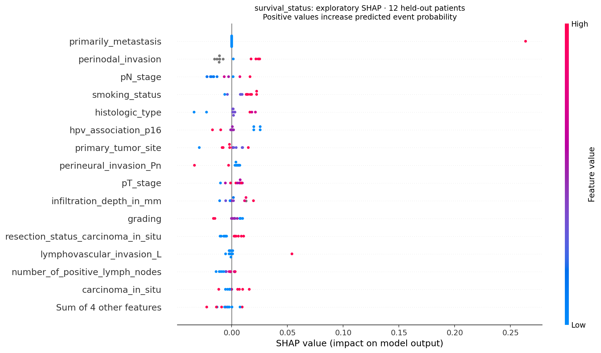
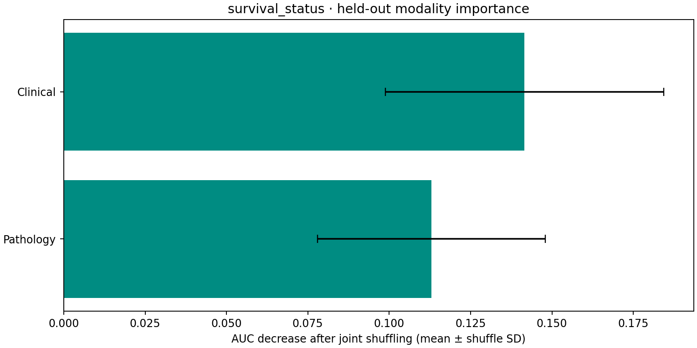
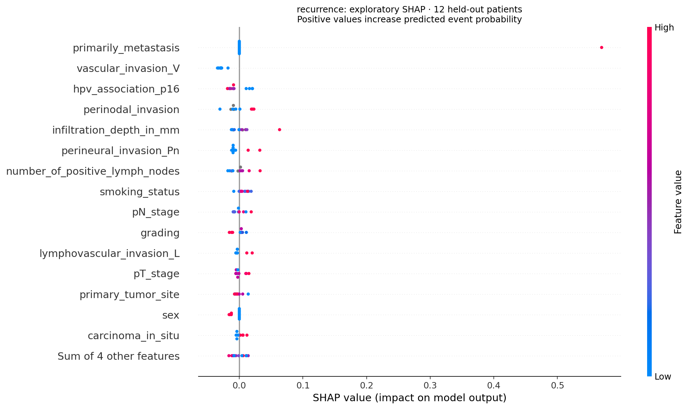
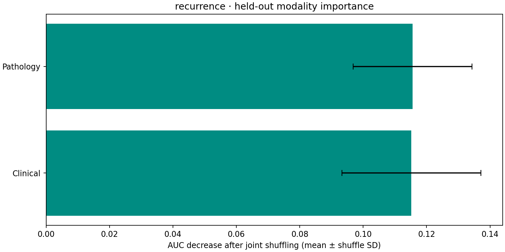

# TabPFN optimization and interpretation

**Observed result: neither selected configuration improved reserved-test ROC AUC over the untuned no-SMOTE baseline. The validation-selected 19-feature clinical/pathology model is retained for interpretation; the original baseline is unchanged.**

Six fixed candidates, three folds per endpoint, official in-distribution training patients only. Selection maximizes mean validation AUC. All candidates omit SMOTE. Thinking uses medium effort, a 60-second fit budget and ROC-AUC objective.

The paper feature tables are reused and inherit upstream cohort-wide encoding/blood preprocessing. Native handling preserves their numeric category codes and remaining missing values; it does not reconstruct unimputed raw blood measurements.

| Endpoint | Selected configuration | Training CV AUC | Final test AUC | Untuned baseline AUC | ΔAUC [95% paired interval] |
|---|---|---:|---:|---:|---:|
| survival_status | native_clinical_pathology | 0.7762 | 0.8114 | 0.8346 | -0.0232 [-0.0814, +0.0361] |
| recurrence | native_clinical_pathology | 0.7517 | 0.7855 | 0.7903 | -0.0048 [-0.0438, +0.0342] |

The final comparison uses a single seed-42 fit per endpoint against the saved seed-42 no-SMOTE, paper-preprocessing baseline. The baseline's name in the earlier paper experiment was `tabpfn_native`, meaning no SMOTE; here `native_default` instead means explicit native categorical preprocessing. These are different configurations.

Final test sets were already inspected in the earlier experiment, so improvements are exploratory. No test metric feeds selection. Selection CV scores are optimistic for the chosen winner and are not nested-CV estimates. Paired bootstrap intervals are conditional on fixed training data and unadjusted for multiple comparisons. Endpoints match released HANCOCK code, not five-year overall survival; no clinical or causal validation follows.

Feature attribution outputs are added separately in `explanations/`; they explain the selected model, never a surrogate baseline. See `protocol.json` for prespecified settings and exact cohort/fold memberships.

Sources: [Thinking mode](https://docs.priorlabs.ai/capabilities/thinking-mode), [interpretability](https://docs.priorlabs.ai/capabilities/interpretability), [HANCOCK paper](https://doi.org/10.1038/s41467-025-62386-6).

## Exploratory explanations: survival_status

Model: `native_clinical_pathology`. SHAP summarizes 12 randomly sampled test patients relative to 8 sampled training-background patients. Maximum probability reconstruction error: 3.03e-05. Feature-rank correlation between ordering repeats: 0.981; top-10 overlap: 9/10.

| Feature | Mean absolute SHAP (percentage points) |
|---|---:|
| primarily_metastasis | 2.197 |
| perinodal_invasion | 1.418 |
| pN_stage | 1.348 |
| smoking_status | 1.301 |
| histologic_type | 1.031 |
| hpv_association_p16 | 1.027 |
| primary_tumor_site | 0.759 |
| perineural_invasion_Pn | 0.727 |

**Sample sensitivity:** one patient contributes 100.0% of the leading feature's absolute attribution (`primarily_metastasis`). This is not a reliable whole-cohort ranking.

These describe model influence in a small explanation sample, not causal risk factors or whole-cohort importance. Category values are published codes; masking breaks cross-feature dependencies. Background-sample sensitivity was not estimated. The selected model omits blood, ICD and TMA inputs, so they receive no SHAP scores. No attribution was used for feature selection.

## Exploratory explanations: recurrence

Model: `native_clinical_pathology`. SHAP summarizes 12 randomly sampled test patients relative to 8 sampled training-background patients. Maximum probability reconstruction error: 4.14e-05. Feature-rank correlation between ordering repeats: 0.975; top-10 overlap: 9/10.

| Feature | Mean absolute SHAP (percentage points) |
|---|---:|
| primarily_metastasis | 4.746 |
| vascular_invasion_V | 2.906 |
| hpv_association_p16 | 1.390 |
| perinodal_invasion | 1.337 |
| infiltration_depth_in_mm | 1.223 |
| perineural_invasion_Pn | 1.153 |
| number_of_positive_lymph_nodes | 1.063 |
| smoking_status | 0.829 |

**Sample sensitivity:** one patient contributes 100.0% of the leading feature's absolute attribution (`primarily_metastasis`). This is not a reliable whole-cohort ranking.

These describe model influence in a small explanation sample, not causal risk factors or whole-cohort importance. Category values are published codes; masking breaks cross-feature dependencies. Background-sample sensitivity was not estimated. The selected model omits blood, ICD and TMA inputs, so they receive no SHAP scores. No attribution was used for feature selection.

